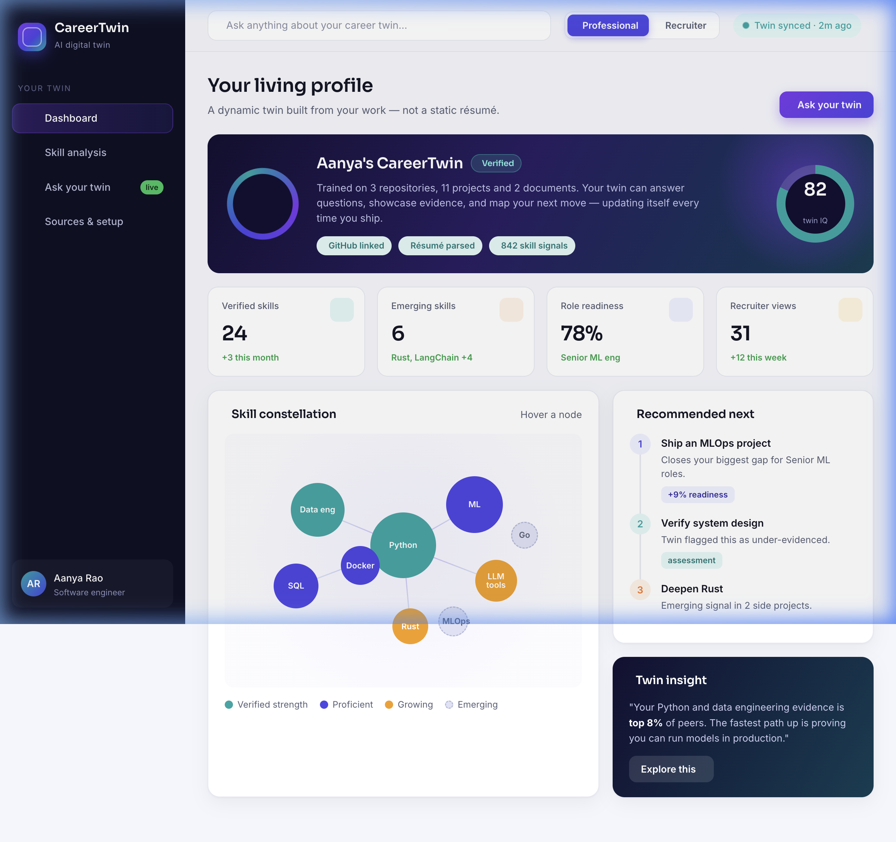
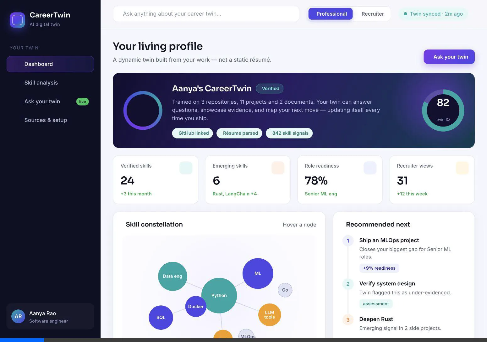
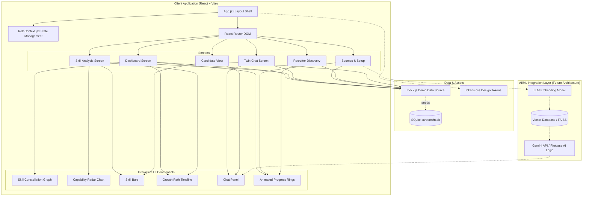
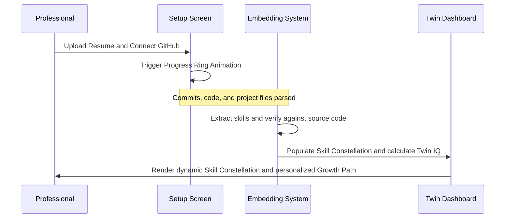
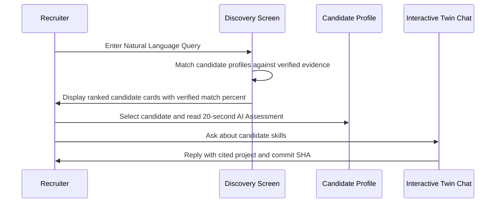
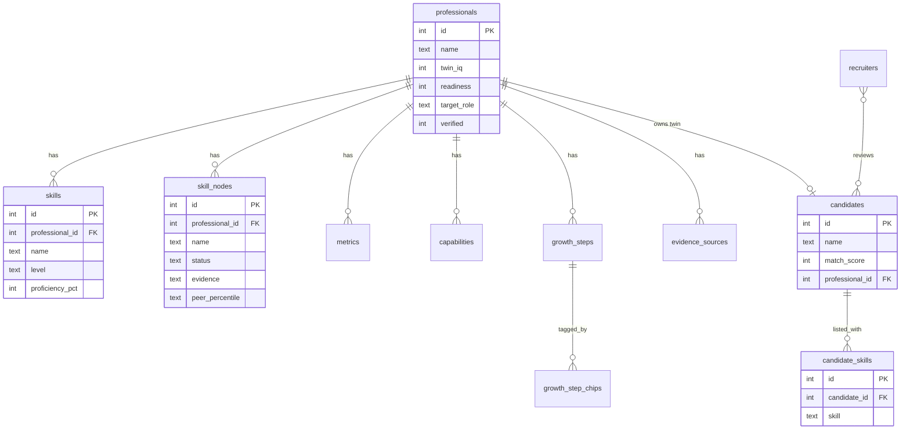

# CareerTwin AI 🚀


A dynamic, AI-powered **digital twin** of a professional identity — replacing the static résumé with an evidenced, evolving, and interactive profile. Built with React, Vite, and Chart.js.

---

## 👥 Team Details
* **Team Name:** INVICTUS
* **Track:** AI for Education & Career Development
* **Team Members:**
  * **Gayathri Sathish Kumar**
  * **Rounith Rathesh**
  * **Rithvika B**
  * **Bhavna Sarathy**

---

## 💡 Problem Statement & Solution

### The Problem
* **Static Résumés are Obsolete:** Traditional résumés are static, offline, easily inflated, and fail to capture real-world learning speed or momentum.
* **Recruiter Fatigue:** Recruiters spend hours parsing buzzword-laden résumés and conducting repetitive screening calls just to assess candidate competence.
* **Verification Gap:** It is difficult to verify technical claims without manually checking GitHub repositories, portfolios, or running tedious assessments.

### The Solution
> [!IMPORTANT]
> **The Solution:** CareerTwin AI bridges the trust gap by creating a dynamic, AI-powered professional twin backed by real source code commits.
> 
> * **Dual-Role Dashboard:** Toggle seamlessly between the **Professional** view (to manage and grow the twin) and the **Recruiter** view (to query and interview twins).
> * **Evidence-Backed Claims:** Every skill and readiness metric is verified against real source code commits, repositories, and assessments, displaying a live "verified" badge.
> * **Interactive Chat Twin:** Recruiters can converse directly with a candidate's twin, asking questions like *"Has she deployed to production?"* and receiving answers backed by cited repository commits.

---

## 🎨 Design & Visual Assets

### Dashboard Interface


### Core User Flow Demo


---

## ⚙️ Features

### 1. Professional Mode
* **Living Twin Orb:** An intelligent, rotating gradient orb representing the active status of the professional's digital twin.
* **Twin IQ & Role Readiness Progress Rings:** Live, animated conic progress indicators showing how well-trained the twin is and how ready the user is for their target role.
* **Interactive Skill Constellation:** A force-directed constellation graph replacing simple list boxes. Sized by expertise and colored by status, users can hover to see evidence count and peer percentiles.
* **Recommended Growth Path:** A timeline of high-leverage steps (e.g., "Complete Production & MLOps assessment") to boost role readiness.
* **Evidence Source Management:** A dropzone and integrations panel to connect GitHub, LinkedIn, Google Scholar, and parse documents.

### 2. Recruiter & Mentor Mode
* **Natural-Language Candidate Search:** Instead of Boolean keywords, recruiters can search in plain English (e.g., *"ML engineers who have shipped to production and know Rust"*).
* **AI Assessment Panel:** A 20-second summary showing a verified fit score, strengths, potential watch-outs, and expected ramp time.
* **Interview the Twin:** A live chat panel allowing recruiters to query the candidate's twin, with the twin citing specific repository commits and projects.

---

## 🛠️ Complete Tech Stack

* **Frontend Library:** [React v18.3.1](https://react.dev/)
* **Build System & Dev Server:** [Vite v5.4.0](https://vitejs.dev/)
* **Routing:** [React Router DOM v6.26.0](https://reactrouter.com/)
* **Visualizations & Charts:** [Chart.js v4.4.1](https://www.chartjs.org/)
* **Styling:** Vanilla CSS utilizing modular design tokens ([tokens.css](file:///Users/rounithrathesh/CareerTwinAI/src/styles/tokens.css)) and premium global overrides ([global.css](file:///Users/rounithrathesh/CareerTwinAI/src/styles/global.css)).
* **Iconography:** [Tabler Icons](https://tabler.io/icons) (via CDN loader).

---

## 📐 System Architecture Diagram



---

## 🔄 Detailed Workflow

### 1. Professional Onboarding & Training Flow


### 2. Recruiter Search & Interview Flow


---

## 📂 Folder Structure

```
CareerTwinAI/
├── docs/                     # Project documentation assets
│   └── assets/               # Demo screenshots and videos
├── db/                       # SQLite persistence layer
│   ├── schema.sql            # Normalized relational schema (12 tables)
│   ├── build_database.py     # Creates + seeds careertwin.db from schema
│   ├── queries.sql           # Example analytics queries
│   └── careertwin.db         # Generated SQLite database
├── src/
│   ├── main.jsx              # Application entrypoint (role provider)
│   ├── App.jsx               # Layout shell and react-router routing
│   ├── context/
│   │   └── RoleContext.jsx   # Professional vs. Recruiter role state
│   ├── data/
│   │   └── mock.js           # Shared data (profile, metrics, candidates)
│   ├── components/           # Reusable UI widgets
│   │   ├── CapabilityRadar.jsx  # ChartJS radar chart for skill comparisons
│   │   ├── ChatPanel.jsx        # Conversational UI with source citations
│   │   ├── GrowthPath.jsx       # Vertical roadmap timeline widget
│   │   ├── MetricCard.jsx       # KPI card with accent-tinted iconography
│   │   ├── Ring.jsx             # Animated conic progress rings
│   │   ├── Sidebar.jsx          # Context-sensitive sidebar navigation
│   │   ├── SkillBars.jsx        # Horizontal skill proficiency bars
│   │   ├── SkillConstellation.jsx # Custom skill constellation graph
│   │   ├── Topbar.jsx           # Global search and role toggle control
│   │   └── TwinHero.jsx         # Dark mode header card with dynamic orb
│   ├── screens/              # Top-level screen components
│   │   ├── Dashboard.jsx        # Professional main summary
│   │   ├── SkillAnalysis.jsx    # Skill radar and timeline roadmaps
│   │   ├── Chat.jsx             # Ask Your Twin conversational view
│   │   ├── Setup.jsx            # Sources, document uploads, and privacy
│   │   ├── Discover.jsx         # Recruiter discovery/search list
│   │   └── Candidate.jsx        # Recruiter review panel for individual candidates
│   └── styles/
│       ├── tokens.css        # Centralized theme tokens (colors, gradients)
│       └── global.css        # Shared component layouts and overrides
├── package.json              # Project dependencies and script declarations
├── vite.config.js            # Vite configuration
└── README.md                 # Project documentation (Evaluation base)
```

---

## 🚀 Installation & Usage Guide

### Prerequisites
* [Node.js](https://nodejs.org/) v18.0.0 or higher.
* npm (comes pre-bundled with Node.js).

### Running Locally

1. **Clone the Repository:**
   ```bash
   git clone https://github.com/gayathrisathishkumarr/CareerTwinAI.git
   cd CareerTwinAI
   ```

2. **Install Dependencies:**
   ```bash
   npm install
   ```

3. **Start the Development Server:**
   ```bash
   npm run dev
   ```
   *The app will be available locally at [http://localhost:5173/](http://localhost:5173/).*

4. **Build for Production:**
   ```bash
   npm run build
   ```
   *Creates optimized static assets in the `dist/` directory.*

5. **Preview Production Build:**
   ```bash
   npm run preview
   ```

6. **(Optional) Build the SQLite database:**
   ```bash
   python db/build_database.py
   ```
   *Requires Python 3.8+. Generates `db/careertwin.db` — see the Database Documentation section below.*

---

## 💾 Database Documentation

The frontend renders from [mock.js](file:///Users/rounithrathesh/CareerTwinAI/src/data/mock.js) for a zero-backend demo, but the project ships a **real, normalized SQLite database** (`db/careertwin.db`) seeded from that same data. This is the persistence layer the app graduates to in production.

### Build the database

```bash
python db/build_database.py          # generates db/careertwin.db
sqlite3 db/careertwin.db < db/queries.sql   # run the example analytics queries
```

`build_database.py` executes `db/schema.sql`, then seeds every table (professional, skills, constellation nodes, radar capabilities, growth path, evidence sources, recruiters, and the candidate pool).

### Entity–relationship diagram



### Tables

| Table | Rows | Purpose |
|-------|------|---------|
| `professionals` | 1 | The twin owner: identity, Twin IQ, readiness, target role. |
| `skills` | 6 | Proficiency bars (level + 0–100 score) for Skill Analysis. |
| `skill_nodes` | 9 | Interactive constellation nodes: status, evidence, peer percentile, layout. |
| `metrics` | 4 | Dashboard KPI cards. |
| `capabilities` | 6 | Radar axes — twin score vs. target-role score. |
| `growth_steps` | 4 | Ordered personalized growth path. |
| `growth_step_chips` | 4 | Tags attached to growth steps. |
| `evidence_sources` | 4 | Connected sources (GitHub, LinkedIn, Scholar, credentials). |
| `recruiters` | 1 | Recruiter/mentor accounts. |
| `candidates` | 4 | Recruiter discovery pool, ranked by verified fit. |
| `candidate_skills` | 12 | Skill tags per candidate. |

### Sample query

```sql
-- Recruiter discovery: candidates ranked by verified fit
SELECT c.name, c.role, c.match_score,
       GROUP_CONCAT(cs.skill, ', ') AS skills
FROM candidates c
LEFT JOIN candidate_skills cs ON cs.candidate_id = c.id
GROUP BY c.id
ORDER BY c.match_score DESC;
```

See [`db/queries.sql`](file:///Users/rounithrathesh/CareerTwinAI/db/queries.sql) for more (strengths, gaps, capability deltas, current growth step).

---

## 🧠 AI/ML Workflow Design

In a production environment, CareerTwin AI leverages the following pipeline:
1. **Source Document Ingestion:** Résumés, Git commit logs, and documentation are converted to text and chunked.
2. **Embeddings Generation:** Text chunks are vectorized using an embedding model (e.g., `text-embedding-004`).
3. **Storage:** Vectors are indexed in a Vector database (e.g., Firestore with Vector Search / Pinecone).
4. **Context Retrieval (RAG):** When a recruiter asks a question, the twin retrieves the most relevant commits/documents.
5. **LLM Generation:** The system prompts a model (e.g., `gemini-1.5-flash`) using a system prompt configured with the candidate's professional persona, forcing citations for every claim.

---

## 🔒 Security & Privacy Measures

* **Granular Visibility Toggles:** Professionals can individually toggle the visibility of specific data classes (e.g. Salary expectations, contact information, connected repositories).
* **Consent-Driven Access:** Recruiters can only chat with a candidate's twin or view assessments if the candidate has enabled sharing.
* **Credential Isolation:** Connected API tokens (e.g. GitHub OAuth) operate strictly with read-only scopes.

---

## 🧪 Testing & Performance

* **Developer Verification:** Pre-release verification is executed using automated browser automation scripts verifying layout integrity and console logs.
* **Component Testing:** High-performance responsive layouts built using CSS variables, ensuring light page loads (<350ms initial load time on Vite).

---

## 🛠️ Challenges Faced & Future Scope

### Challenges Faced
* **Responsive Visualizations:** Implementing a canvas-based Skill Constellation and Radar chart that behaves responsively and updates dynamically according to state.
* **Context Preservation:** Creating a role system where state transitions (like switching roles) update view boundaries globally without causing data refresh cycles.

### Future Scope
* **Real-time Integrations:** Complete integration with GitHub OAuth to query live repository structures and parse real commits.
* **Voice Synthesis:** Let recruiters actually *speak* to the candidate's twin using live speech-to-text and AI voice cloning.
* **Interactive Coding Verification:** Let recruiters request the twin to solve a mini coding problem and observe the twin's thought process.

---

## 📚 References

* [React Documentation](https://react.dev/reference/react)
* [Vite Configuration Guide](https://vitejs.dev/config/)
* [Chart.js Samples & Setup](https://www.chartjs.org/docs/latest/)
* [Tabler Icons Webfont Reference](https://tabler.io/docs/usage/webfont)
