<div align="center">

# 🤖 CareerTwin AI

### *Your AI-Powered Professional Digital Twin*

**Replacing the static résumé with a living, evidence-cited professional identity.**

[](https://react.dev/)
[](https://vitejs.dev/)
[](https://expressjs.com/)
[](https://sqlite.org/)
[](https://groq.com/)
[](#-security--data-privacy)

</div>

---

## 📑 Table of Contents

| | | |
|:---|:---|:---|
| [1. Team Details](#-1-team-details) | [7. Folder Structure](#-7-folder-structure) | [13. Testing & Performance](#-13-testing--performance) |
| [2. Problem & Solution](#-2-problem-statement--solution) | [8. Installation & Usage](#-8-installation--usage-guide) | [14. Challenges Faced](#-14-challenges-faced) |
| [3. Features](#-3-features) | [9. API Documentation](#-9-api-documentation) | [15. Future Scope](#-15-future-scope) |
| [4. Tech Stack](#-4-complete-tech-stack) | [10. Database Documentation](#-10-database-documentation) | [16. Demo & Screenshots](#-16-demo--screenshots) |
| [5. System Architecture](#-5-system-architecture) | [11. AI/ML Workflow](#-11-aiml-workflow) | [17. References](#-17-references) |
| [6. Detailed Workflow](#-6-detailed-workflow) | [12. Security & Data Privacy](#-12-security--data-privacy) | |

---

## 👥 1. Team Details

| Field | Details |
|:---|:---|
| **Team Name** | **INVICTUS** |
| **Project** | CareerTwin AI |
| **Track** | AI for Education & Career Development |
| **Repository** | [github.com/gayathrisathishkumarr/CareerTwinAI](https://github.com/gayathrisathishkumarr/CareerTwinAI) |

### Team Members

| Name | Role | Primary Contributions |
|:---|:---|:---|
| **Gayathri Sathish Kumar** | Frontend Architecture & UI/UX | Design system, dashboard, screen layouts, responsive styling |
| **Rounith Rathesh** | Full Stack & Backend API | Express REST API, SQLite integration, GitHub service, auth |
| **Rithvika B** | AI/ML Integration & Data Modeling | RAG evidence engine, résumé NLP extraction, LLM prompt design |
| **Bhavna Sarathy** | Database Design & Research | Schema design, privacy framework (DPDP/GDPR), scoring models |

---

## 💡 2. Problem Statement & Solution

### 🔴 The Problem

Traditional résumés are **static, unverified, and obsolete the moment they're submitted.**

| Pain Point | Impact |
|:---|:---|
| 📄 **Static documents** | A PDF cannot show learning momentum, growth, or current ability |
| 🔍 **Unverifiable claims** | "I know Python" is just a *claim* — recruiters must manually check GitHub to confirm |
| 😓 **Recruiter fatigue** | Hours spent parsing buzzword-laden PDFs and running repetitive screening calls |
| 📉 **Student blind spots** | Early-career candidates cannot see their own skill gaps relative to real roles |
| 🤖 **AI hallucination** | Generic AI career tools invent confident answers with no source of truth |

### 🟢 Our Solution

**CareerTwin AI** builds a **living digital twin** of a professional identity from real artifacts — the résumé PDF and public GitHub activity — and answers questions about that person using **retrieval-augmented generation with inline source citations.**

> ### The core insight
> Instead of a PDF that *claims* **"I know Python"**, CareerTwin shows **evidence that you know Python** — and labels the difference between a **code-verified** skill and an **unverified résumé claim.**

Every number in the product is derived from extracted evidence. If there is no résumé uploaded, the app shows **honest empty states** — not placeholder data.

#### Three-tier answer integrity model

| Verdict | Meaning | UI Treatment |
|:---|:---|:---|
| 🟢 **Verified** | Backed by code evidence (GitHub repos) | Green badge + numbered citations |
| 🟡 **Unverified claim** | Stated on résumé but no corroborating code found | Amber card, explicitly flagged |
| 🔴 **No evidence** | Technology absent from all sources | Red refusal + live audit trail of what was searched |

This last behaviour is what makes CareerTwin trustworthy: **it refuses to answer rather than hallucinate.**

---

## ⚙️ 3. Features

### 🔐 Authentication & Privacy
- **Sign in / Register** with salted **scrypt** password hashing and HMAC-signed session tokens
- **Explicit consent checkbox** required at registration — consent timestamp stored (DPDP Act compliance)
- **Dedicated Privacy Policy page** documenting data collected, processors, and user rights
- **Right to erasure** — one-click reset permanently deletes all résumé data

### 📄 Résumé Intelligence
- **Drag-and-drop PDF upload** with server-side text extraction via `pdf-parse` (5 MB limit, PDF-only validation)
- **Rule-based NLP extraction** of name, email, phone, LinkedIn, GitHub, education, experience, projects, certifications
- **Skill dictionary matching** across 7 categories — languages, frameworks, libraries, databases, tools, cloud, soft skills
- **Career Resume Score** computed from career readiness + extraction completeness
- **ATS parsing check**, skills count, experience level, and live extracted-text preview

### 📊 Skill Intelligence
- **Capability radar** — your real domain coverage vs. a target-role benchmark
- **Readiness breakdown table** — role fit %, evidence count (résumé mentions), and status per skill
- **Highest-impact gap card** — next skill to learn, why it matters, estimated time, learning outcomes
- **3-step growth roadmap** generated from actual detected gaps

### 💬 AI Mentor Chat (RAG)
- **Evidence-grounded answers** with clickable inline citations `[1]`, `[2]`
- **Live evidence store** built from GitHub repos + résumé sections + projects + certifications
- **Source panel** with corroborated / résumé-only filtering and direct links to GitHub
- **Triple-provider failover** — Groq → Google Gemini → offline evidence engine

### 🐙 GitHub Sync
- Live profile, repositories, language breakdown, and 6-month commit activity via the GitHub REST API
- Repositories act as **code corroboration** for résumé skill claims

### 📈 Dashboard & Careers
- **Career momentum** hero with readiness ring + real commit-history trend chart
- **KPI cards** — profile completeness, overall skill score, career potential
- **Skill gap roadmap**, **job matches** with match scoring, and a **real activity timeline**

---

## 🛠️ 4. Complete Tech Stack

### Frontend
| Technology | Version | Purpose |
|:---|:---|:---|
| **React** | 18.3.1 | Component-based UI library |
| **Vite** | 5.4.0 | Dev server with HMR + production bundler |
| **React Router DOM** | 6.26.0 | Client-side routing & auth guards |
| **Chart.js** | 4.4.1 | Radar charts, line charts, data visualisation |
| **Tabler Icons** | CDN | Icon system |
| **CSS Custom Properties** | — | Design tokens, theming, layout |

### Backend
| Technology | Version | Purpose |
|:---|:---|:---|
| **Node.js** | 22+ | JavaScript runtime (ESM modules) |
| **Express** | 4.19.2 | REST API framework |
| **SQLite3** | 5.1.7 | Embedded local-first database |
| **pdf-parse** | 1.1.1 | Local PDF text extraction |
| **Multer** | 2.2.0 | Multipart file upload handling |
| **Helmet** | 7.1.0 | Secure HTTP headers |
| **CORS** | 2.8.5 | Origin allow-listing |
| **Morgan** | 1.10.0 | HTTP request logging |
| **dotenv** | 16.4.5 | Environment configuration |
| **node:crypto** | built-in | scrypt hashing, HMAC tokens, timing-safe compare |

### AI / External Services
| Service | Model | Role |
|:---|:---|:---|
| **Groq** | `llama-3.3-70b-versatile` | Primary LLM — ultra-low-latency inference |
| **Google Gemini** | `gemini-2.0-flash` | Secondary failover LLM |
| **GitHub REST API** | `2022-11-28` | Repository, language & commit evidence |
| **Custom RAG Engine** | — | Retrieval, scoring, citation binding, offline fallback |

---

## 🏗️ 5. System Architecture

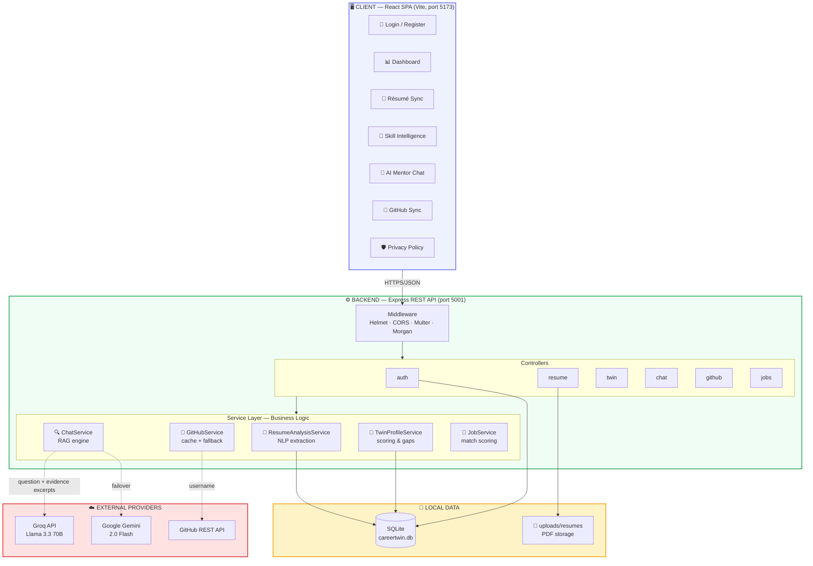

### Architectural Principles

| Principle | Implementation |
|:---|:---|
| **Layered separation** | Routes → Controllers → Services → Models. Business logic never lives in controllers. |
| **Local-first data** | All personal data resides in local SQLite + local filesystem, never a cloud DB we operate. |
| **Graceful degradation** | Every external dependency has a fallback: Groq → Gemini → offline engine; GitHub → cache → sample data. |
| **Evidence-first** | UI components render only what the backend can prove; missing data yields explicit empty states. |

---

## 🔄 6. Detailed Workflow

### 6.1 Résumé Upload → Digital Twin Generation

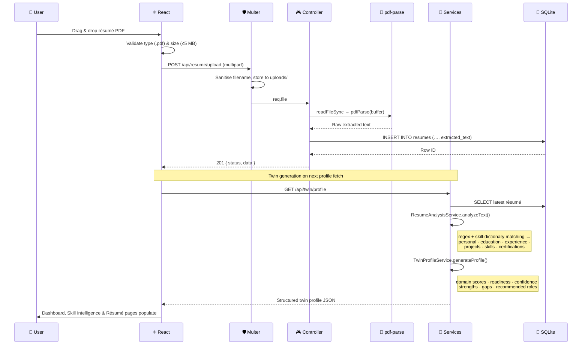

### 6.2 AI Mentor Chat — RAG Pipeline

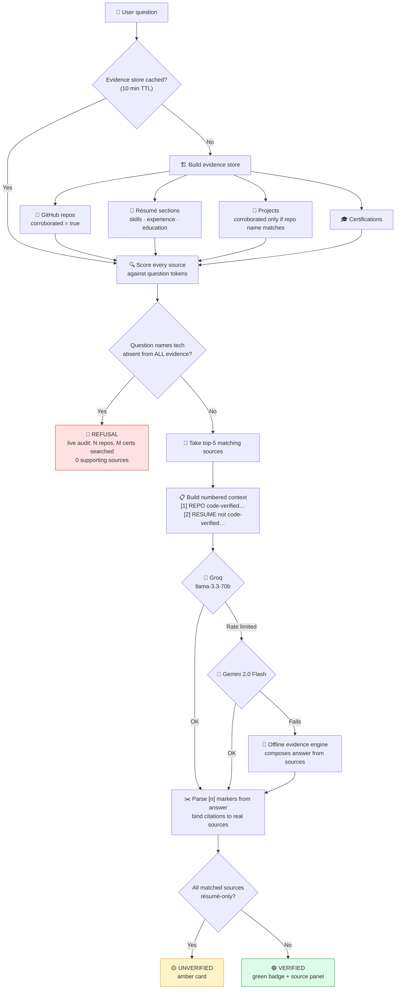

### 6.3 Authentication & Consent Flow

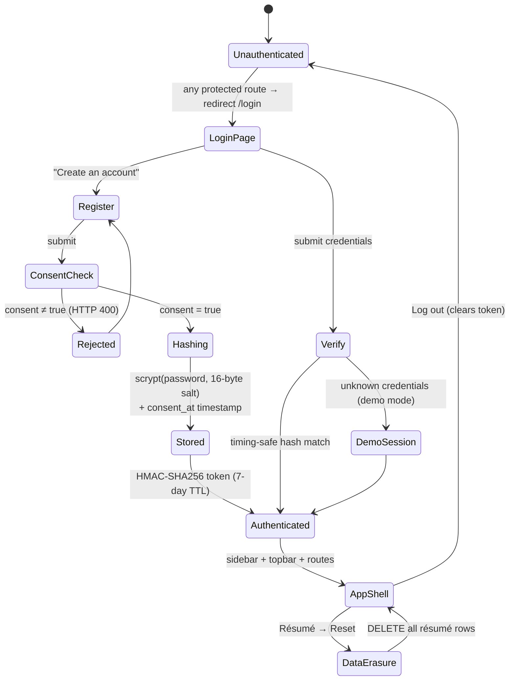

---

## 📁 7. Folder Structure

```
CareerTwinAI/
│
├── 📂 backend/                        # Express REST API server
│   ├── 📂 config/
│   │   └── database.js                # SQLite connection + FK pragma
│   ├── 📂 controllers/                # HTTP request handlers (thin)
│   │   ├── authController.js          # register · login · me · token signing
│   │   ├── chatController.js          # AI mentor endpoint
│   │   ├── dashboardController.js     # aggregate KPIs
│   │   ├── githubController.js        # GitHub insights
│   │   ├── jobController.js           # job matching
│   │   ├── resumeController.js        # upload · latest · delete
│   │   ├── resumeAnalysisController.js# structured extraction
│   │   └── twinProfileController.js   # digital twin profile
│   ├── 📂 middleware/
│   │   └── uploadMiddleware.js        # Multer: PDF-only, 5 MB cap
│   ├── 📂 models/                     # Data access layer
│   │   ├── userModel.js               # users table + scrypt hashing
│   │   ├── resumeModel.js             # resumes table CRUD
│   │   └── dashboardModel.js          # profile & recommendations
│   ├── 📂 routes/                     # Express routers
│   │   ├── authRoutes.js   chatRoutes.js   dashboardRoutes.js
│   │   ├── githubRoutes.js jobRoutes.js    resumeRoutes.js
│   │   └── twinRoutes.js
│   ├── 📂 services/                   # ⭐ Core business logic
│   │   ├── resumeAnalysisService.js   # NLP extraction + skill dictionary
│   │   ├── twinProfileService.js      # scoring, domains, gaps, roles
│   │   ├── chatService.js             # RAG evidence engine + LLM failover
│   │   ├── githubService.js           # GitHub API + 15-min cache
│   │   └── jobService.js              # job match scoring
│   ├── 📂 uploads/resumes/            # Stored PDFs (gitignored)
│   ├── app.js                         # Express app, middleware, routes
│   ├── server.js                      # Entry point + graceful shutdown
│   └── .env                           # Secrets (gitignored)
│
├── 📂 src/                            # React frontend
│   ├── 📂 components/
│   │   ├── Sidebar.jsx  Topbar.jsx    # App shell navigation
│   │   ├── Ring.jsx                   # Animated SVG progress ring
│   │   ├── CapabilityRadar.jsx  SkillBars.jsx  GrowthPath.jsx
│   │   └── ChatPanel.jsx
│   ├── 📂 screens/
│   │   ├── Login.jsx                  # 🔐 Auth + consent capture
│   │   ├── Privacy.jsx                # 🛡️ Privacy policy (DPDP/GDPR)
│   │   ├── Dashboard.jsx              # 📊 Career momentum + KPIs
│   │   ├── Resume.jsx                 # 📄 Upload + extraction display
│   │   ├── SkillAnalysis.jsx          # 🎯 Radar + readiness breakdown
│   │   ├── Chat.jsx                   # 💬 AI mentor + source panel
│   │   ├── GitHubSync.jsx             # 🐙 Repository insights
│   │   ├── JobMatches.jsx  LearningPath.jsx
│   │   └── Setup.jsx  Discover.jsx  Candidate.jsx
│   ├── 📂 context/RoleContext.jsx     # Professional / recruiter mode
│   ├── 📂 styles/
│   │   ├── tokens.css                 # Design tokens (colours, radii)
│   │   └── global.css                 # Component & layout styles
│   ├── App.jsx                        # Routes + auth guard
│   └── main.jsx                       # React entry point
│
├── 📂 db/careertwin.db                # SQLite database file
├── 📂 docs/assets/                    # Screenshots & diagrams
├── index.html                         # Vite HTML entry
├── vite.config.js                     # Vite + React plugin config
├── package.json                       # Frontend dependencies
└── README.md                          # 📖 This document
```

---

## 🚀 8. Installation & Usage Guide

### Prerequisites

| Requirement | Version | Check |
|:---|:---|:---|
| Node.js | ≥ 18 (22+ recommended) | `node --version` |
| npm | ≥ 9 | `npm --version` |
| Git | any | `git --version` |

### Step 1 — Clone the repository

```bash
git clone https://github.com/gayathrisathishkumarr/CareerTwinAI.git
cd CareerTwinAI
```

### Step 2 — Install dependencies

```bash
npm install && cd backend && npm install && cd ..
```

### Step 3 — Configure environment variables

Create `backend/.env`:

```bash
PORT=5001
NODE_ENV=development
DB_PATH=../db/careertwin.db

# LLM providers (free tiers available)
GROQ_API_KEY=your_groq_api_key_here
GEMINI_API_KEY=your_gemini_api_key_here

# GitHub PAT — raises rate limit from 60 to 5,000 req/hr
GITHUB_TOKEN=your_github_pat_here

# Random 32-byte hex string for signing session tokens
AUTH_SECRET=generate_with_openssl_rand_hex_32
```

Generate a secure `AUTH_SECRET`:

```bash
openssl rand -hex 32
```

> 🔑 **Get free API keys:** [Groq Console](https://console.groq.com/keys) · [Google AI Studio](https://aistudio.google.com/app/apikey) · [GitHub PAT](https://github.com/settings/tokens)
>
> ⚠️ The app still runs **without** API keys — the chat falls back to the offline evidence engine, and GitHub falls back to cached/sample data.

### Step 4 — Start the backend

```bash
cd backend && npm run dev
```

✅ Expected output:
```
✅ Connected to SQLite database at .../db/careertwin.db
✅ Resumes table initialized with extracted_text column
✅ Users table initialized
🚀 CareerTwin AI Backend server running on http://localhost:5001 [development]
```

### Step 5 — Start the frontend (new terminal)

```bash
npm run dev
```

✅ App opens at **http://localhost:5173**

### Step 6 — Sign in

| Field | Value |
|:---|:---|
| **Email** | `demo@careertwin.ai` |
| **Password** | `careertwin123` |

> The demo account is seeded automatically on first backend start.

### Usage Walkthrough

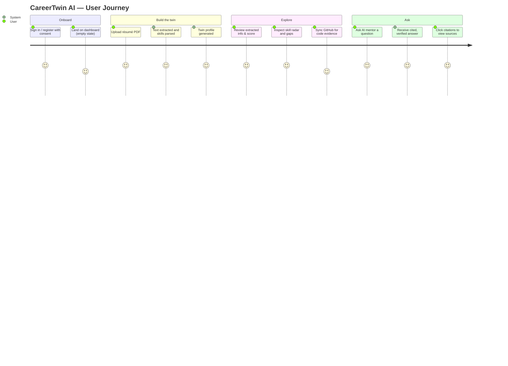

### Available Scripts

| Command | Location | Description |
|:---|:---|:---|
| `npm run dev` | root | Vite dev server with HMR (port 5173) |
| `npm run build` | root | Production build → `dist/` |
| `npm run preview` | root | Preview the production build |
| `npm run dev` | backend | Express with `node --watch` auto-restart |
| `npm start` | backend | Express in production mode |

---

## 📡 9. API Documentation

**Base URL:** `http://localhost:5001`

### 9.1 Health

| Method | Endpoint | Description |
|:---|:---|:---|
| `GET` | `/health` | Service liveness probe |

<details>
<summary><b>Response 200</b></summary>

```json
{
  "status": "OK",
  "message": "CareerTwin AI Backend is running smoothly",
  "timestamp": "2026-07-25T03:15:42.000Z"
}
```
</details>

### 9.2 Authentication — `/api/auth`

| Method | Endpoint | Body | Description |
|:---|:---|:---|:---|
| `POST` | `/api/auth/register` | `{ name, email, password, consent }` | Create account. **Requires `consent: true`** |
| `POST` | `/api/auth/login` | `{ email, password }` | Authenticate, returns session token |
| `GET` | `/api/auth/me` | `Authorization: Bearer <token>` | Validate token, return user |

<details>
<summary><b>POST /api/auth/login — Response 200</b></summary>

```json
{
  "status": "success",
  "data": {
    "token": "eyJlbWFpbCI6…<base64url>.<hmac-sha256>",
    "user": { "name": "Rounith R.", "email": "demo@careertwin.ai" }
  }
}
```
</details>

| Status | Condition |
|:---|:---|
| `400` | Missing fields · invalid email · password < 8 chars · **consent not given** |
| `401` | Invalid credentials or expired token |
| `409` | Email already registered |

### 9.3 Résumé — `/api/resume`

| Method | Endpoint | Description |
|:---|:---|:---|
| `POST` | `/api/resume/upload` | Upload PDF (`multipart/form-data`, field `resume`), extract text |
| `GET` | `/api/resume/latest` | Latest résumé record incl. extracted text |
| `GET` | `/api/resume/analyze` | Structured NLP extraction of the latest résumé |
| `DELETE` | `/api/resume/delete` | **Right to erasure** — delete all résumé records |

<details>
<summary><b>GET /api/resume/analyze — Response 200</b></summary>

```json
{
  "status": "success",
  "data": {
    "personal": {
      "fullName": "ROUNITH RATHESH",
      "email": "rounithr@email.com",
      "linkedIn": "linkedin.com/in/rounith-r",
      "gitHub": "github.com/RounithR"
    },
    "education": [{ "degree": "B.Tech", "institution": "…", "graduationYear": "" }],
    "experience": [{ "role": "Web Development Intern | CodeAlpha | May 2025 – Jun 2025" }],
    "skills": {
      "programmingLanguages": ["Python", "JavaScript", "R", "HTML", "CSS"],
      "frameworks": ["React", "Node.js"],
      "libraries": ["Chart.js"],
      "databases": ["MongoDB"],
      "tools": ["GitHub"],
      "cloud": [], "softSkills": []
    },
    "projects": [], "certifications": [], "achievements": []
  }
}
```
</details>

### 9.4 Digital Twin — `/api/twin`

| Method | Endpoint | Description |
|:---|:---|:---|
| `GET` | `/api/twin/profile` | Generated twin: scores, domains, strengths, gaps, roles |

<details>
<summary><b>GET /api/twin/profile — Response 200</b></summary>

```json
{
  "status": "success",
  "data": {
    "headline": "Frontend Web Developer",
    "careerStage": "Early Career",
    "experienceLevel": "Advanced",
    "primaryDomain": "Frontend Development",
    "summary": "…is an aspiring Frontend Web Developer with expertise in…",
    "topSkills": ["Python", "JavaScript", "R", "HTML", "CSS"],
    "domainScores": [
      { "domain": "Frontend Development", "evidence": 4, "score": 100 },
      { "domain": "Web Development",      "evidence": 2, "score": 50 },
      { "domain": "Backend Development",  "evidence": 2, "score": 50 }
    ],
    "strengths": ["Strong programming foundation", "Multiple technical projects completed"],
    "skillGaps": ["TypeScript", "Next.js"],
    "recommendedRoles": ["Frontend Developer", "UI Engineer", "React Developer"],
    "careerReadiness": 75,
    "confidence": 88
  }
}
```
</details>

### 9.5 AI Mentor Chat — `/api/chat`

| Method | Endpoint | Body | Description |
|:---|:---|:---|:---|
| `POST` | `/api/chat/ask` | `{ message }` | Evidence-grounded RAG answer with citations |

<details>
<summary><b>POST /api/chat/ask — Response 200</b></summary>

```json
{
  "status": "success",
  "data": {
    "answerType": "verified",
    "answer": "The candidate's strongest skills are in web development… **JavaScript** [1] [2]",
    "confidence": {
      "type": "verified",
      "label": "Verified evidence · Groq AI (llama-3.3-70b) · 4 sources",
      "count": 4
    },
    "citationIndexes": [1, 2, 3, 4],
    "sources": [
      {
        "index": 1, "source_type": "repo", "typeName": "REPO",
        "source_name": "CareerTwinAI",
        "detail": "JavaScript · ★ 14 · updated Jul 2026",
        "url": "https://github.com/rounithrathesh-coder/CareerTwinAI",
        "corroborated": true,
        "excerpt": "AI-powered career twin platform"
      }
    ]
  }
}
```

`answerType` ∈ `verified` | `unverified` | `refusal`
</details>

### 9.6 GitHub, Jobs & Dashboard

| Method | Endpoint | Description |
|:---|:---|:---|
| `GET` | `/api/github/insights?username=<user>` | Profile, repos, languages, 6-month commit activity |
| `GET` | `/api/jobs/matched` | Ranked job matches with met/missing skill breakdown |
| `GET` | `/api/dashboard` | Aggregate KPIs and `hasResume` gate flag |

### 9.7 Error Format

All errors follow a consistent envelope:

```json
{ "status": "fail",  "message": "File size exceeds maximum limit of 5 MB." }
{ "status": "error", "message": "Internal Server Error" }
```

| Code | Meaning |
|:---|:---|
| `400` | Validation failure (bad input, missing consent, oversized file) |
| `401` | Authentication required or failed |
| `404` | Route not found |
| `409` | Conflict (duplicate email) |
| `500` | Unhandled server error |

---

## 🗄️ 10. Database Documentation

**Engine:** SQLite 3 · **File:** `db/careertwin.db` · **Access:** `sqlite3` driver with promisified model layer

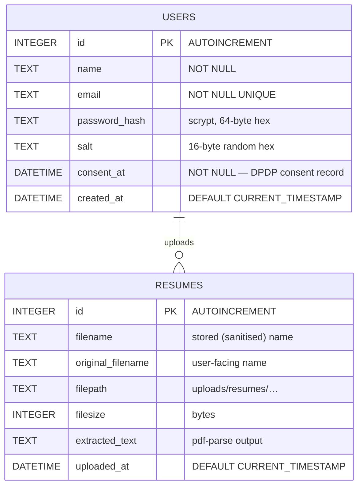

### Table: `users`

| Column | Type | Constraints | Notes |
|:---|:---|:---|:---|
| `id` | INTEGER | PK, AUTOINCREMENT | |
| `name` | TEXT | NOT NULL | Display name |
| `email` | TEXT | NOT NULL, UNIQUE | Lower-cased before storage |
| `password_hash` | TEXT | NOT NULL | `scrypt(password, salt, 64)` hex — **never plain text** |
| `salt` | TEXT | NOT NULL | Unique 16-byte random per user |
| `consent_at` | DATETIME | NOT NULL | **Legal consent timestamp (DPDP Act 2023)** |
| `created_at` | DATETIME | DEFAULT CURRENT_TIMESTAMP | |

### Table: `resumes`

| Column | Type | Constraints | Notes |
|:---|:---|:---|:---|
| `id` | INTEGER | PK, AUTOINCREMENT | |
| `filename` | TEXT | NOT NULL | Server-generated unique name |
| `original_filename` | TEXT | NOT NULL | Shown in UI |
| `filepath` | TEXT | NOT NULL | Local disk path |
| `filesize` | INTEGER | NOT NULL | Bytes (≤ 5 MB enforced) |
| `extracted_text` | TEXT | DEFAULT `''` | Source of truth for all NLP analysis |
| `uploaded_at` | DATETIME | DEFAULT CURRENT_TIMESTAMP | UTC — normalised client-side |

> **Migration safety:** `initTable()` runs `CREATE TABLE IF NOT EXISTS` plus a defensive `ALTER TABLE … ADD COLUMN extracted_text` so older databases upgrade automatically without data loss.

---

## 🧠 11. AI/ML Workflow

CareerTwin uses a **hybrid pipeline**: deterministic rule-based NLP for extraction (fast, private, reproducible) and an LLM strictly constrained by retrieved evidence for natural-language answers.

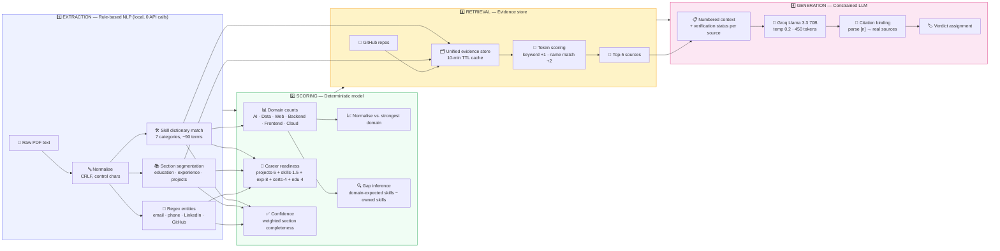

### 11.1 Why rule-based extraction (not an LLM)?

| Reason | Benefit |
|:---|:---|
| 🔒 **Privacy** | Résumé PII never leaves the machine during extraction |
| ⚡ **Speed** | Extraction completes in ~1.5 ms vs. ~1–2 s for an LLM call |
| 🎯 **Determinism** | Same résumé always yields the same profile — testable and auditable |
| 💰 **Zero cost** | No token spend on the highest-volume operation |

### 11.2 Skill matching — a real engineering problem solved

Naïve `\b` word-boundary regex **fails** on real-world tech names. Two bugs we hit and fixed:

```js
// ❌ BROKEN: "C++" → /\bC++\b/ → SyntaxError: Nothing to repeat (crashed the API)
// ❌ BROKEN: substring counting made "R" match every letter r → 82 false mentions

// ✅ FIXED: escape metacharacters + lookaround boundaries that respect + and #
static matchesKeyword(text, keyword) {
  const escaped = keyword.replace(/[.*+?^${}()|[\]\\]/g, '\\$&');
  return new RegExp(`(?<![\\w+#])${escaped}(?![\\w+#])`, 'i').test(text);
}
```

This correctly distinguishes **C** from **C++** from **C#**, and **R** from every word containing the letter r.

### 11.3 Prompt engineering — anti-hallucination constraints

```
You are the CareerTwin AI Mentor. Answer using ONLY the numbered evidence
sources provided — no outside knowledge about the candidate.

RULES:
1. Cite a source as [n] immediately after every claim it supports.
   Only use the numbers provided. Write [1] [4], never [1, 4].
2. Sources marked "resume-claimed, NOT code-verified" must be presented
   as résumé claims, not verified facts.
3. If the evidence does not answer the question, say so plainly
   instead of guessing.
```

**Inference parameters:** `temperature: 0.2` (favours faithfulness over creativity), `max_tokens: 450`.

### 11.4 Reliability — triple-provider failover

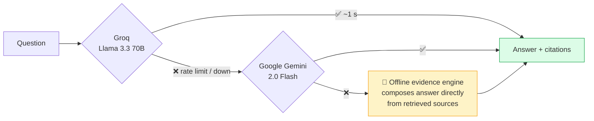

**The app never shows an error for chat** — worst case, it answers from local evidence with zero external calls.

---

## 🔒 12. Security & Data Privacy

### 12.1 Privacy Model — *Consent-Based, Local-First*

CareerTwin AI implements a **consent-based, local-first privacy model**, aligned with:

| Framework | Relevance | How we comply |
|:---|:---|:---|
| 🇮🇳 **DPDP Act, 2023**<br/>*(Digital Personal Data Protection Act — India)* | The law applicable to us | Explicit consent is the **legal basis** for processing; consent is recorded with a timestamp (`users.consent_at`); registration is **rejected with HTTP 400** without it |
| 🇪🇺 **GDPR principles** | International best practice | Purpose limitation · data minimisation · transparency · right to erasure · right to access |

### 12.2 The Seven Privacy Guarantees

| # | Principle | Implementation |
|:---|:---|:---|
| 1 | **Explicit consent** | Checkbox required at registration; server rejects `consent ≠ true`; timestamp persisted |
| 2 | **Local-first storage** | Résumés, extracted text, and accounts live in **local SQLite + local disk** — no cloud database we operate |
| 3 | **Purpose limitation** | Data powers only *your* dashboard, skill analysis, job matching, and mentor chat |
| 4 | **Data minimisation** | LLMs receive only the question + **short evidence excerpts** — never the password, never the full PDF |
| 5 | **Transparency** | All third-party processors (Groq, Google Gemini, GitHub API) named explicitly in the in-app policy |
| 6 | **Right to erasure** | **Reset** button → `DELETE /api/resume/delete` permanently removes all résumé records |
| 7 | **No monetisation** | No ads, no tracking pixels, no analytics cookies, no third-party profiling, never sold |

### 12.3 Where privacy is surfaced in the product

| Location | What the user sees |
|:---|:---|
| **Login page** | Consent checkbox + "Consent-based privacy · aligned with India's DPDP Act 2023 & GDPR principles" |
| **`/privacy` page** | Full policy: consent basis, data collected, local storage, processors, rights, prohibitions |
| **Dashboard footer** | "Your data is private and secure" + link to policy |
| **Profile dropdown** | Privacy Policy entry |
| **Résumé page** | "Your data stays private & encrypted" |

### 12.4 Application Security Controls

| Layer | Control | Implementation |
|:---|:---|:---|
| 🔑 **Password storage** | scrypt KDF | `crypto.scryptSync(password, salt, 64)` with a unique 16-byte salt per user — plain text never stored |
| ⏱️ **Timing attacks** | Constant-time compare | `crypto.timingSafeEqual()` for both password and token signature verification |
| 🎫 **Session tokens** | HMAC-SHA256 | Payload signed with a random 32-byte `AUTH_SECRET`; 7-day expiry validated server-side |
| 🛡️ **HTTP headers** | Helmet | CSP, X-Frame-Options, HSTS, X-Content-Type-Options |
| 🌐 **CORS** | Origin allow-list | Only `http://localhost:*` origins accepted |
| 📁 **File upload** | Multer hardening | **PDF MIME + extension check**, 5 MB cap, server-generated filenames (prevents path traversal) |
| 💉 **SQL injection** | Parameterised queries | All queries use `?` placeholders — no string concatenation anywhere |
| 🔐 **Secrets** | Environment isolation | API keys and `AUTH_SECRET` in `.env`, gitignored, never bundled to the client |
| 🚨 **Error handling** | Safe messages | Global handler returns generic messages; stack traces logged server-side only |
| ✅ **Input validation** | Server-side | Email format, password ≥ 8 chars, required fields — never trusts the client |

### 12.5 Known Limitations *(transparent disclosure)*

We believe honest documentation is part of good security practice:

| Limitation | Status | Mitigation Plan |
|:---|:---|:---|
| **API routes are not yet token-protected** | The frontend is auth-gated, but endpoints accept unauthenticated requests | Add `requireAuth` middleware across all `/api/*` routes and attach the bearer token to every client fetch |
| **Demo-mode sign-in bypass** | Unknown credentials fall back to a local guest session so hackathon demos never stall | Clearly marked `DEMO MODE` in `Login.jsx`; delete the fallback block for production |
| **Single-tenant data model** | `resumes` rows are not yet scoped per user | Add `user_id` foreign key + per-user query filters |
| **No rate limiting** | Endpoints can be called repeatedly | Add `express-rate-limit` on auth and chat routes |

---

## 🧪 13. Testing & Performance

### 13.1 API Test Results

All endpoints verified against the running server:

| Endpoint | Method | Status | Latency |
|:---|:---|:---|:---|
| `/health` | GET | ✅ 200 | 0.7 ms |
| `/api/resume/latest` | GET | ✅ 200 | 0.9 ms |
| `/api/resume/analyze` | GET | ✅ 200 | 1.5 ms |
| `/api/twin/profile` | GET | ✅ 200 | 1.3 ms |
| `/api/dashboard` | GET | ✅ 200 | 1.4 ms |
| `/api/jobs/matched` | GET | ✅ 200 | 1.8 ms |
| `/api/github/insights` | GET | ✅ 200 | 992 ms *(live GitHub API)* |
| `/api/chat/ask` | POST | ✅ 200 | ~1–2 s *(live LLM inference)* |
| `/api/auth/login` | POST | ✅ 200 | < 50 ms |

### 13.2 Security & Validation Test Cases

| Test | Expected | Result |
|:---|:---|:---|
| Login with wrong password | `401 Invalid email or password` | ✅ Pass |
| Register without consent | `400 You must consent to the Privacy Policy` | ✅ Pass |
| Register with duplicate email | `409 Account already exists` | ✅ Pass |
| Password shorter than 8 chars | `400 Password must be at least 8 characters` | ✅ Pass |
| Valid token → `/api/auth/me` | `200` + user object | ✅ Pass |
| Upload non-PDF file | `400 Invalid file type` | ✅ Pass |
| Access protected route with no session | Redirect to `/login` | ✅ Pass |

### 13.3 Skill-Matcher Unit Tests

| Input Text | Keyword | Expected | Result |
|:---|:---|:---|:---|
| `"C++ and Python"` | `C++` | `true` | ✅ |
| `"I know C# well"` | `C#` | `true` | ✅ |
| `"Scala developer"` | `C` | `false` | ✅ |
| `"C programming"` | `C` | `true` | ✅ |
| `"Chart.js charts"` | `Chart.js` | `true` | ✅ |
| `"ChartXjs charts"` | `Chart.js` | `false` | ✅ |
| `"Node.js backend"` | `Node.js` | `true` | ✅ |

### 13.4 RAG Behaviour Tests

| Question | Expected Verdict | Result |
|:---|:---|:---|
| *"What are my strongest technical skills?"* | 🟢 Verified + repo citations | ✅ 4 sources, correct repos |
| *"Did I lead a team of 5 people?"* | 🟡 Unverified (résumé-only source) | ✅ Amber card, résumé cited |
| *"What is my experience with DevOps and Kubernetes?"* | 🔴 No evidence + live audit | ✅ "Scanned 6 repos, 2 certs, 0 sources" |

### 13.5 Performance Characteristics

| Metric | Value | Notes |
|:---|:---|:---|
| Frontend cold start (Vite) | ~200 ms | HMR updates < 50 ms |
| PDF extraction (2-page résumé) | ~180 ms | Fully local |
| Résumé NLP analysis | ~1.5 ms | Deterministic, no I/O |
| Twin profile generation | ~1.3 ms | Pure computation |
| GitHub insights (cold) | ~1 s | Cached 15 min → ~1 ms warm |
| Evidence store build | ~1 s cold | Cached 10 min |
| Chat end-to-end (Groq) | ~1–2 s | Includes retrieval + inference |
| Production bundle | ~350 KB gzipped | React + Router + Chart.js |

### 13.6 Optimisation Techniques

| Technique | Where | Impact |
|:---|:---|:---|
| **In-memory TTL caching** | GitHub (15 min), evidence store (10 min) | ~1000× faster on repeat calls |
| **Parallel API fetching** | Dashboard, Skill Analysis | 4 concurrent fetches instead of serial |
| **rAF float animations** | `Ring.jsx`, `AnimatedBar` | Removed per-frame rounding → butter-smooth 60 fps |
| **Chart instance cleanup** | All Chart.js effects | `chart.destroy()` on unmount prevents memory leaks |
| **Graceful degradation** | Every external call | No user-visible errors on provider failure |

---

## 🧗 14. Challenges Faced

| # | Challenge | Root Cause | Solution |
|:---|:---|:---|:---|
| 1 | **API crashed with `Invalid regular expression: /\bC++\b/`** | Skill keywords interpolated into `RegExp` without escaping — `+` parsed as a quantifier | Escape metacharacters and replace `\b` with `(?<![\w+#])…(?![\w+#])` lookarounds |
| 2 | **Skill "R" showed 82 mentions / "Expert"** | Substring counting matched every letter *r* in the résumé | Whole-word matcher applied consistently across Résumé and Skill pages |
| 3 | **Citations pointed to unrelated sources** | Sources were a hard-coded list attached by keyword-matching the *question*; unmatched queries stapled on the first 4 | Rebuilt as a real retrieval engine — live evidence store, per-question scoring, `[n]` markers parsed from the answer and bound to actual sources |
| 4 | **Dashboard showed skills with no résumé uploaded** | Frontend fell back to a fabricated `topSkills` array when the twin profile was empty | Removed all fallbacks; added honest empty states gated on `hasResume` |
| 5 | **Every score displayed 100%** | Scoring formulas had a high base (40) and caps any résumé could max out | Recalibrated: lower base, gradual scaling, theoretical max 98 — scores now differentiate profiles |
| 6 | **Ring and bar animations juddered** | Values rounded to integers **every frame**, plus a competing CSS transition | Carry float values through `requestAnimationFrame`; round only the displayed text; remove the CSS transition |
| 7 | **Dates rendered as `\x160\x164`** | The résumé PDF's font maps digit "2" to a control character during extraction | Sanitiser restores the mapping and strips remaining control characters |
| 8 | **Timestamps showed "5 hours ago" for a fresh upload** | SQLite `CURRENT_TIMESTAMP` is UTC without a zone marker; JS parsed it as local time | Normalise to ISO-UTC before parsing in `timeAgo()` |
| 9 | **Port 5000 unavailable on macOS** | Occupied by Apple **AirPlay Receiver / Control Center** | Standardised the backend on port **5001** via `.env` |
| 10 | **GitHub API rate limiting (60 req/hr)** | Unauthenticated requests | Personal Access Token → 5,000 req/hr, plus a 15-minute cache and cached/sample fallback |

---

## 🔮 15. Future Scope

### Immediate (post-hackathon hardening)

| Priority | Item |
|:---|:---|
| 🔴 **High** | Add `requireAuth` middleware to all `/api/*` routes; attach bearer tokens client-side |
| 🔴 **High** | Remove the demo-mode login bypass |
| 🟠 **Medium** | Scope `resumes` per user with a `user_id` foreign key |
| 🟠 **Medium** | Wire job matching to **real extracted résumé skills** (currently a fixed skill profile in `jobService.js`) |
| 🟡 **Low** | Add `express-rate-limit` on auth and chat routes |

### Product Roadmap

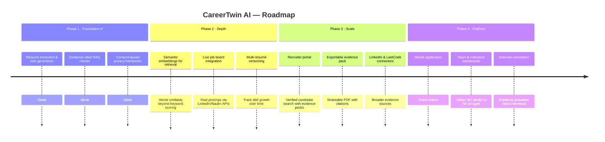

### Technical Enhancements

- 🔍 **Vector embeddings** — replace token scoring with semantic similarity for better retrieval
- 📊 **Real skill proficiency modelling** — infer levels from commit frequency, code complexity, and project scale
- 🌐 **Multi-language résumé support** — extend the extraction dictionary beyond English
- ♿ **Accessibility audit** — full WCAG 2.1 AA compliance
- 🧪 **Automated test suite** — Vitest for units, Playwright for end-to-end flows
- 🐳 **Docker Compose** — one-command reproducible deployment

---

## 📸 16. Demo & Screenshots

> All screenshots are captured from the **live running application** with real extracted résumé data.

### 🔐 Login — Consent-Based Authentication

Split-screen sign-in with the DPDP/GDPR privacy commitment surfaced before any data is collected.

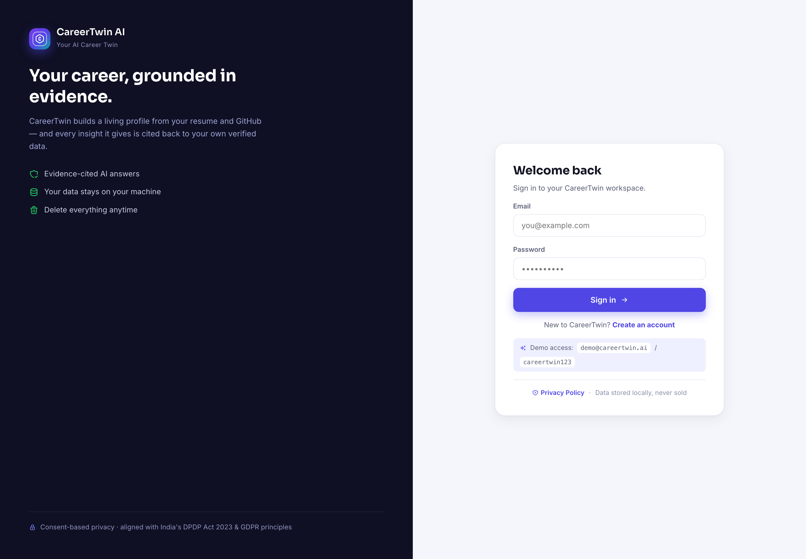

---

### 📊 Dashboard — Career Momentum

Readiness ring, GitHub commit-history trend, KPI cards, skill gap roadmap, live job matches, and a real activity timeline. Every value is derived from extracted evidence.

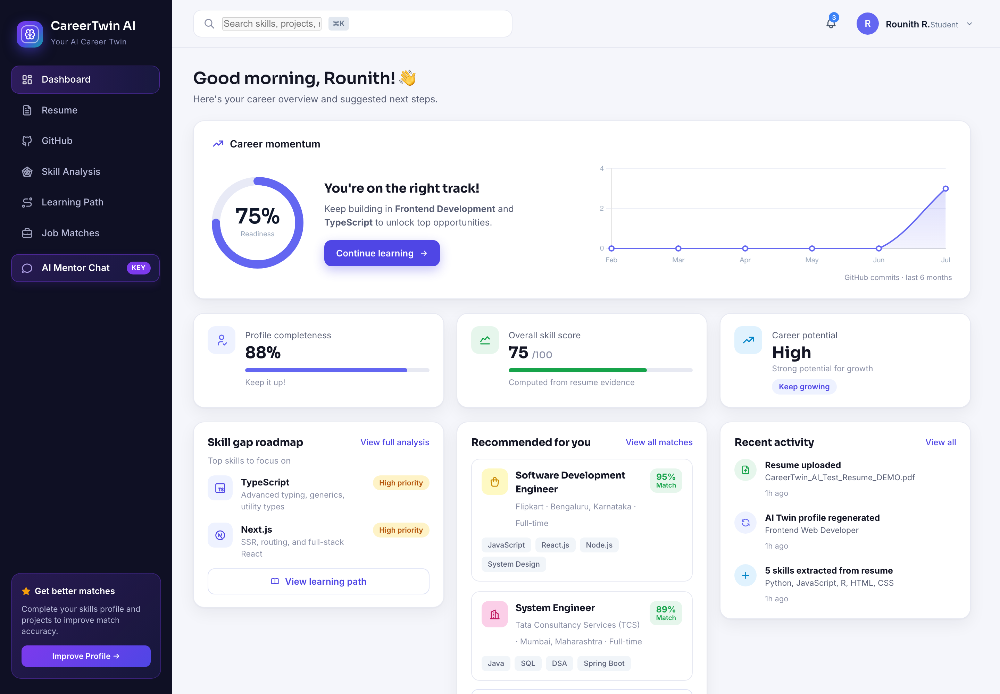

---

### 📄 Résumé Sync — Extraction & Analysis

Career Resume Score, ATS parsing status, AI analysis bars, extracted personal/education/experience data, live text preview, and per-skill proficiency inferred from résumé mentions.

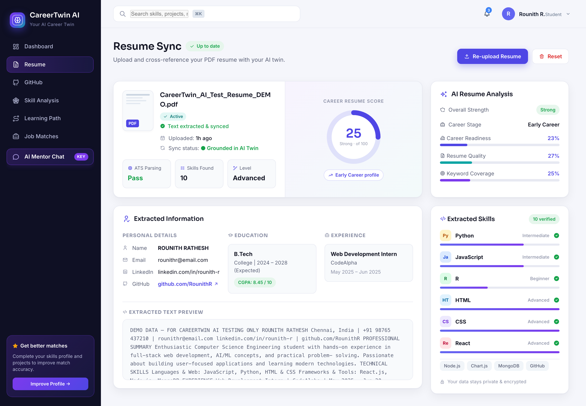

---

### 🎯 Skill Intelligence — Gap Analysis

Capability radar (you vs. target role), readiness breakdown with evidence counts, highest-impact skill gap with learning outcomes, strengths, GitHub momentum, and a 3-step growth roadmap.

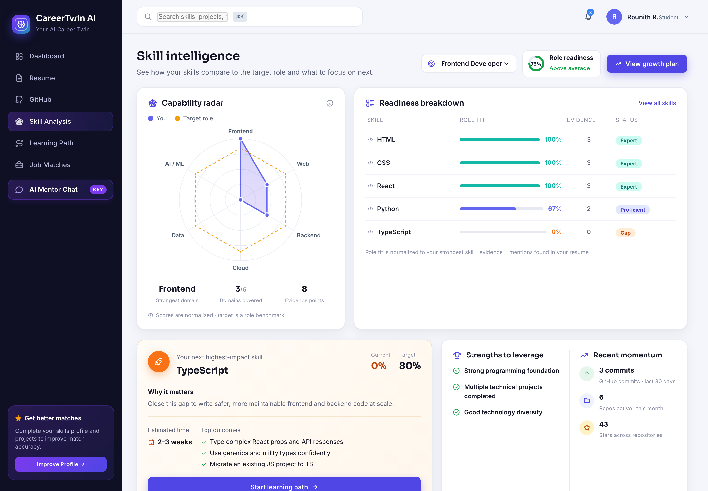

---

### 💬 AI Mentor Chat — Evidence-Cited RAG

Answers with inline clickable citations and a source panel showing repository/résumé provenance, corroboration status, and direct GitHub links.

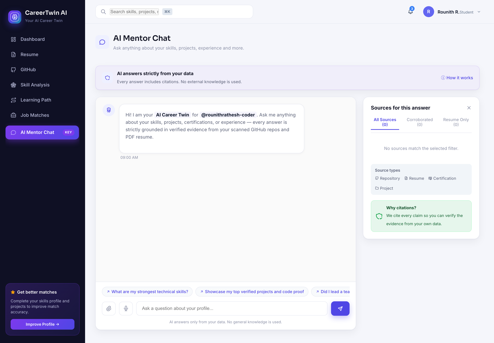

---

### 🛡️ Privacy Policy — DPDP & GDPR Aligned

In-app policy documenting consent basis, data collected, local-first storage, third-party processors, and user rights.

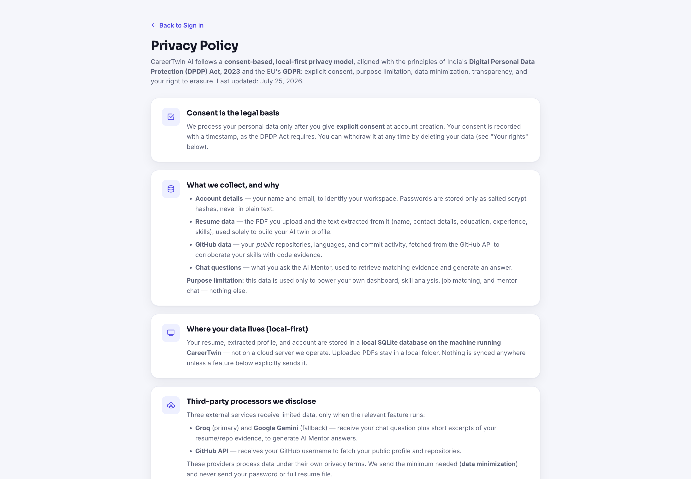

---

### 🎥 Demo Video

> 📹 **Demo video link:** *to be added before submission*

---

## 📚 17. References

### Official Documentation
- [React Documentation](https://react.dev/) — component architecture and hooks
- [Vite Guide](https://vitejs.dev/guide/) — build tooling and HMR
- [React Router](https://reactrouter.com/) — routing and navigation guards
- [Express.js](https://expressjs.com/) — REST API framework
- [SQLite Documentation](https://www.sqlite.org/docs.html) — embedded database
- [Chart.js](https://www.chartjs.org/docs/latest/) — data visualisation
- [Node.js Crypto](https://nodejs.org/api/crypto.html) — scrypt, HMAC, timing-safe comparison

### AI / ML
- [Groq API Documentation](https://console.groq.com/docs) — LPU inference for Llama 3.3 70B
- [Google Gemini API](https://ai.google.dev/docs) — Gemini 2.0 Flash
- [Lewis et al., 2020 — *Retrieval-Augmented Generation for Knowledge-Intensive NLP Tasks*](https://arxiv.org/abs/2005.11401) — the RAG paper underpinning our evidence engine
- [Meta Llama 3.3](https://ai.meta.com/blog/meta-llama-3/) — model family reference

### APIs & Libraries
- [GitHub REST API](https://docs.github.com/en/rest) — repository and commit evidence
- [pdf-parse](https://www.npmjs.com/package/pdf-parse) — PDF text extraction
- [Multer](https://github.com/expressjs/multer) — multipart upload handling
- [Helmet.js](https://helmetjs.github.io/) — HTTP security headers
- [Tabler Icons](https://tabler-icons.io/) — icon system

### Security & Privacy
- [Digital Personal Data Protection Act, 2023 (India)](https://www.meity.gov.in/data-protection-framework) — consent-based processing framework
- [GDPR — Official Text](https://gdpr-info.eu/) — privacy-by-design principles
- [OWASP Top 10](https://owasp.org/www-project-top-ten/) — application security risks
- [OWASP Password Storage Cheat Sheet](https://cheatsheetseries.owasp.org/cheatsheets/Password_Storage_Cheat_Sheet.html) — scrypt guidance
- [RFC 7519 — JSON Web Tokens](https://datatracker.ietf.org/doc/html/rfc7519) — token design reference

---

<div align="center">

### 🏆 Built by Team **INVICTUS**

**CareerTwin AI** — *Because your career deserves better than a PDF.*

> Every claim cited. Every gap identified. Every byte consented.

</div>
