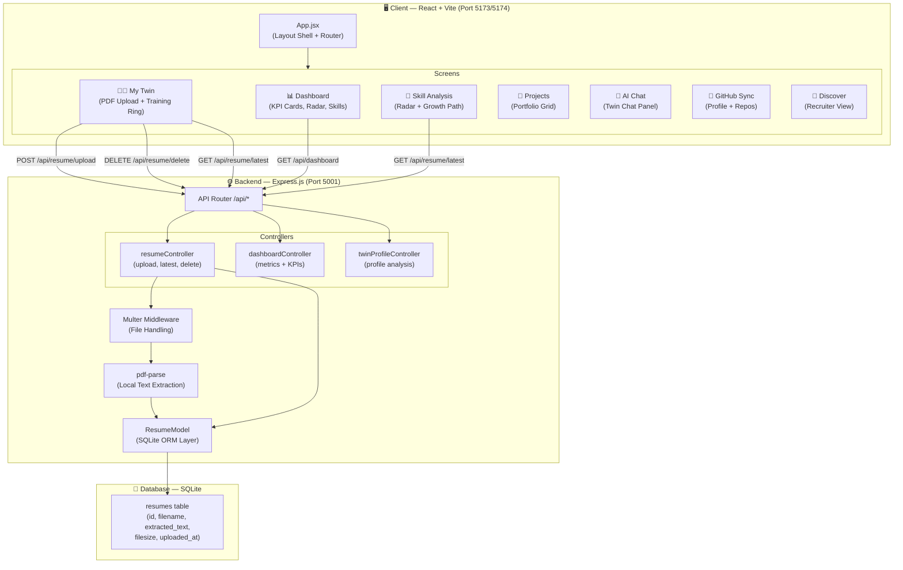
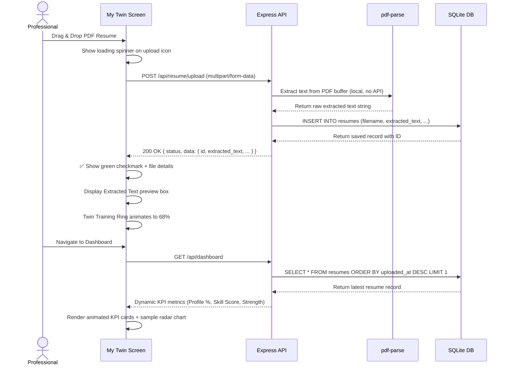
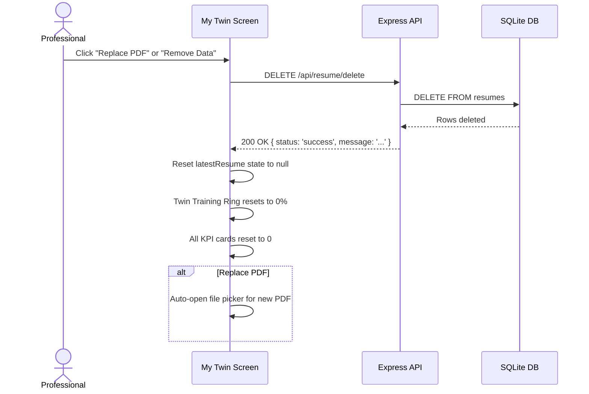
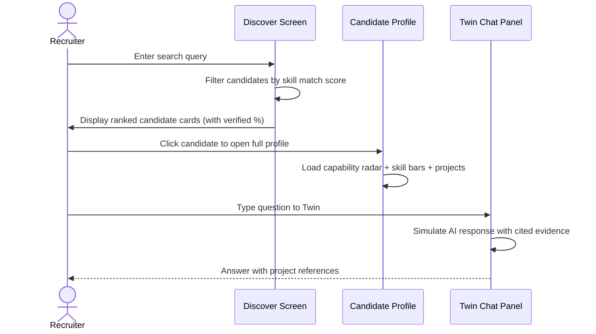
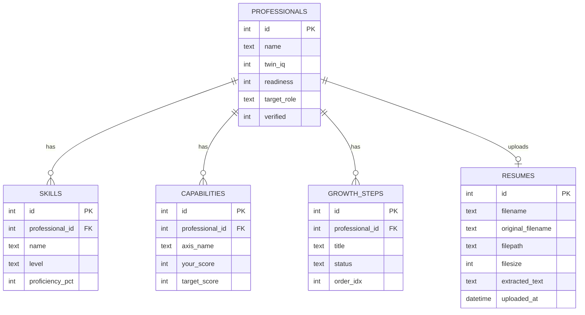
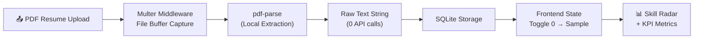
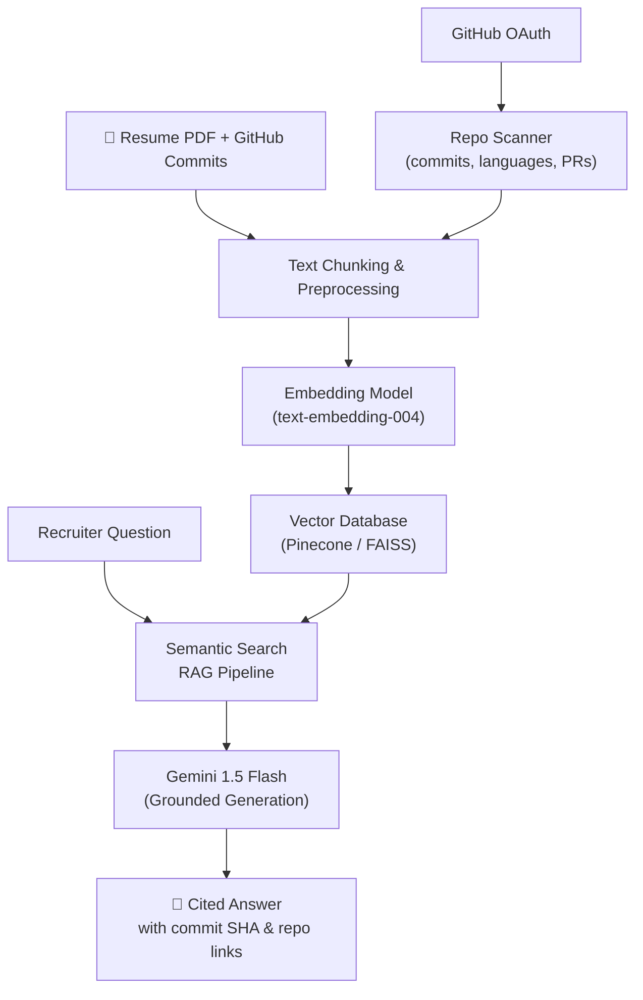

<div align="center">

# 🤖 CareerTwin AI

### *Your AI-Powered Professional Digital Twin*

> Replacing the static résumé with a living, evidenced, and interactive professional identity.

[](https://react.dev/)
[](https://vitejs.dev/)
[](https://expressjs.com/)
[](https://sqlite.org/)
[](LICENSE)

</div>

---

## 👥 Team Details

| Field | Details |
|:---|:---|
| **Team Name** | INVICTUS |
| **Track** | AI for Education & Career Development |
| **Event** | Hackathon 2026 |

### Team Members

| Name | Role |
|:---|:---|
| **Gayathri Sathish Kumar** | Frontend Architecture & UI/UX Design |
| **Rounith Rathesh** | Full Stack Development & Backend API |
| **Rithvika B** | AI/ML Integration & Data Modeling |
| **Bhavna Sarathy** | Database Design & Research |

---

## 💡 Problem Statement & Solution

### The Problem

Traditional résumés are **static, unverified, and outdated** the moment they're submitted.

- 📄 **Static Résumés are Obsolete** — They are offline documents that fail to capture a professional's real-time learning speed, momentum, or evidence-backed skill development.
- 😓 **Recruiter Fatigue** — Recruiters spend hours parsing buzzword-laden PDFs and conducting repetitive screening calls to assess candidate competence.
- 🔍 **Verification Gap** — Technical claims are difficult to verify without manually checking GitHub repositories, portfolios, or conducting assessments.
- 📉 **Student Blind Spots** — Students and early-career professionals lack the tools to understand their own skill gaps relative to industry roles.

---

### The Solution

**CareerTwin AI** creates a **living, AI-powered professional twin** that replaces the static PDF résumé with a dynamic, evidence-backed digital profile.

```
📤 Upload PDF Resume  →  🔍 Local Text Extraction  →  📊 Dynamic Skill Visualization
         ↓                        ↓                              ↓
  Career Twin Profile      Skill Gap Analysis          Personalized Growth Path
         ↓                        ↓                              ↓
  🧑‍💼 Professional View     💬 AI Mentor Chat           🎯 Job Match Scoring
```

> **Key Insight:** Instead of a PDF that says *"I know Python"*, CareerTwin AI shows *evidence that you know Python* — backed by code, projects, and real skill metrics.

---

## ⚙️ Features

### 🧑‍💻 Professional Mode

| Feature | Description |
|:---|:---|
| **PDF Resume Uploader** | Drag & drop PDF upload with 100% local text extraction (no external API) |
| **Extracted Text Preview** | Live extracted resume text with character count and raw text viewer |
| **Dynamic 0 → Sample State** | Metrics start at 0 before upload; populate with visualization samples after |
| **Twin Training Ring** | Animated conic progress ring showing how well your Career Twin is trained |
| **Role Readiness Indicator** | Percentage readiness for target roles (e.g., SDE Intern, ML Engineer) |
| **Capability Radar Chart** | Hexagonal radar comparing individual skills vs. industry average |
| **Skill Bars** | Horizontal proficiency bars per skill (Python, DSA, Machine Learning, etc.) |
| **Personalized Growth Path** | Step-by-step career roadmap to bridge skill gaps |
| **Projects Portfolio** | Interactive Projects page with complexity meters and tech stack badges |
| **Replace & Remove Data** | One-click to replace PDF or remove all uploaded data and reset the app |

### 🔎 Recruiter & Mentor Mode

| Feature | Description |
|:---|:---|
| **Candidate Discovery** | Browse and search verified candidate profiles |
| **AI Assessment Panel** | Verified fit score, strengths, watch-outs, and expected ramp time |
| **Interactive Twin Chat** | Chat panel to ask candidates' twins questions directly |
| **GitHub Sync View** | Live GitHub profile analysis: repos, languages, commit history |

---

## 🛠️ Complete Tech Stack

### Frontend
| Technology | Version | Purpose |
|:---|:---|:---|
| React | 18.3.1 | UI component library |
| Vite | 5.4.0 | Build system & dev server |
| React Router DOM | 6.26.0 | Client-side routing |
| Chart.js | 4.4.1 | Radar charts & data visualizations |
| Tabler Icons | CDN | Icon set (700+ icons) |
| Vanilla CSS | — | Custom design system with CSS tokens |

### Backend
| Technology | Version | Purpose |
|:---|:---|:---|
| Node.js | 18+ | JavaScript runtime |
| Express.js | 4.19.2 | REST API server |
| Multer | 2.2.0 | Multipart file upload middleware |
| pdf-parse | 1.1.1 | Local PDF text extraction |
| SQLite3 | 5.1.7 | Embedded relational database |
| Helmet | 7.1.0 | HTTP security headers |
| Morgan | 1.10.0 | HTTP request logger |
| CORS | 2.8.5 | Cross-origin resource sharing |
| dotenv | 16.4.5 | Environment variable management |

---

## 📐 System Architecture Diagram



---

## 🔄 Detailed Workflow

### 1. Professional Onboarding & Resume Upload Flow



### 2. Replace / Remove Data Flow



### 3. Recruiter Discovery Flow



---

## 📂 Folder Structure

```
CareerTwinAI/
│
├── 📁 backend/                       # Express.js Node.js Backend
│   ├── 📁 config/
│   │   └── db.js                     # SQLite database connection
│   ├── 📁 controllers/
│   │   ├── dashboardController.js    # GET /api/dashboard — dynamic KPI logic
│   │   ├── resumeController.js       # Upload / fetch / delete resume endpoints
│   │   ├── resumeAnalysisController.js  # Resume text analysis handler
│   │   └── twinProfileController.js  # Twin profile analysis endpoint
│   ├── 📁 middleware/
│   │   └── upload.js                 # Multer config (PDF only, 10MB limit)
│   ├── 📁 models/
│   │   └── resumeModel.js            # SQLite ORM: save, getLatest, deleteAll
│   ├── 📁 routes/
│   │   ├── resumeRoutes.js           # POST/GET/DELETE /api/resume/*
│   │   ├── dashboardRoutes.js        # GET /api/dashboard
│   │   └── twinRoutes.js             # GET /api/twin/profile
│   ├── 📁 services/
│   │   └── resumeAnalysisService.js  # Local PDF text pattern extraction
│   ├── 📁 uploads/                   # Uploaded PDF files (local storage)
│   ├── .env                          # Environment variables (PORT, etc.)
│   ├── .env.example                  # Environment variable template
│   ├── app.js                        # Express app: CORS, Helmet, routes
│   └── server.js                     # Backend entrypoint (Port 5001)
│
├── 📁 db/
│   ├── schema.sql                    # Relational database schema
│   ├── queries.sql                   # Sample analytics queries
│   └── careertwin.db                 # SQLite database file (auto-generated)
│
├── 📁 src/                           # React Frontend (Vite)
│   ├── main.jsx                      # React app entrypoint
│   ├── App.jsx                       # React Router + layout shell
│   │
│   ├── 📁 components/                # Reusable UI widgets
│   │   ├── CapabilityRadar.jsx       # Chart.js radar chart (you vs. industry)
│   │   ├── ChatPanel.jsx             # Conversational twin chat UI
│   │   ├── GrowthPath.jsx            # Vertical career roadmap timeline
│   │   ├── Ring.jsx                  # Animated conic progress ring
│   │   ├── Sidebar.jsx               # App navigation sidebar
│   │   ├── SkillBars.jsx             # Horizontal skill proficiency bars
│   │   └── Topbar.jsx                # Top navigation with search
│   │
│   ├── 📁 context/
│   │   └── RoleContext.jsx           # Professional vs. Recruiter role toggle
│   │
│   ├── 📁 data/
│   │   └── mock.js                   # Demo data (candidates, profile metrics)
│   │
│   ├── 📁 screens/                   # Full-page screen components
│   │   ├── Dashboard.jsx             # Main overview: KPIs, radar, skills
│   │   ├── Setup.jsx                 # My Twin: PDF uploader & training
│   │   ├── SkillAnalysis.jsx         # Skill radar + growth path
│   │   ├── Projects.jsx              # Projects portfolio grid
│   │   ├── Chat.jsx                  # AI Mentor Chat screen
│   │   ├── GitHubSync.jsx            # GitHub profile sync + repo browser
│   │   ├── Resume.jsx                # Detailed resume viewer screen
│   │   ├── Discover.jsx              # Recruiter: candidate discovery
│   │   └── Candidate.jsx             # Recruiter: individual candidate profile
│   │
│   └── 📁 styles/
│       ├── tokens.css                # Global CSS custom properties (colors, fonts)
│       └── global.css                # Shared layout overrides
│
├── index.html                        # HTML entrypoint
├── vite.config.js                    # Vite build configuration
├── package.json                      # Frontend package manifest
└── README.md                         # Project documentation (this file)
```

---

## 🚀 Installation & Usage Guide

### Prerequisites

- [Node.js](https://nodejs.org/) **v18.0.0 or higher**
- npm (bundled with Node.js)
- Git

---

### Step 1 — Clone the Repository

```bash
git clone https://github.com/gayathrisathishkumarr/CareerTwinAI.git
cd CareerTwinAI
```

---

### Step 2 — Start the Backend Server

```bash
# Navigate to backend
cd backend

# Install backend dependencies
npm install

# Create environment file
cp .env.example .env

# Start development server (auto-reloads on change)
npm run dev
```

> ✅ Backend will run at **http://localhost:5001**

---

### Step 3 — Start the Frontend (New Terminal)

```bash
# From the project root
cd ..

# Install frontend dependencies
npm install

# Start Vite dev server
npm run dev
```

> ✅ Frontend will run at **http://localhost:5173** or **http://localhost:5174**

---

### Step 4 — Use the App

1. Open your browser at `http://localhost:5173`
2. Navigate to **"My Twin"** in the sidebar
3. Drag & drop your **PDF resume** to train your twin
4. Explore the **Dashboard** for AI-powered skill insights
5. Visit **Skill Analysis** for your radar chart and growth path
6. Check out **Projects** to showcase your portfolio

---

### Build for Production

```bash
npm run build
```

> Outputs optimized static assets to `dist/`

---

## 🔌 API / Database Documentation

### REST API Endpoints

| Method | Endpoint | Description | Request | Response |
|:---|:---|:---|:---|:---|
| `POST` | `/api/resume/upload` | Upload PDF, extract text locally, save to DB | `multipart/form-data` (resume file) | `{ status, data: { id, filename, extracted_text, filesize, uploaded_at } }` |
| `GET` | `/api/resume/latest` | Fetch latest uploaded resume record | — | `{ status, data: resume_object \| null }` |
| `DELETE` | `/api/resume/delete` | Delete all resume records (reset app state) | — | `{ status, message }` |
| `GET` | `/api/dashboard` | Fetch dynamic KPI metrics | — | `{ status, data: { hasResume, completeness, skillScore, ... } }` |
| `GET` | `/api/twin/profile` | Fetch career twin full analysis | — | `{ status, data: twin_profile }` |

---

### Database Schema

The backend uses **SQLite** (`db/careertwin.db`) with a `resumes` table:

```sql
CREATE TABLE IF NOT EXISTS resumes (
    id                INTEGER PRIMARY KEY AUTOINCREMENT,
    filename          TEXT NOT NULL,
    original_filename TEXT NOT NULL,
    filepath          TEXT NOT NULL,
    filesize          INTEGER,
    extracted_text    TEXT,
    uploaded_at       DATETIME DEFAULT CURRENT_TIMESTAMP
);
```

#### Entity Relationship Diagram



#### Sample Query

```sql
-- Get the latest uploaded resume with metadata
SELECT id, original_filename, filesize, uploaded_at,
       LENGTH(extracted_text) AS text_length
FROM resumes
ORDER BY uploaded_at DESC
LIMIT 1;
```

---

## 🧠 AI/ML Workflow

### Current Implementation — Local Processing (No External API)



**Key design decision:** All PDF extraction is done **100% locally** using `pdf-parse` with no external AI API calls. This ensures:
- ✅ Zero API costs
- ✅ Full privacy (data stays on your machine)
- ✅ Instant offline processing

---

### Future AI/ML Architecture (Production)



**Planned AI Features:**
1. **Embedding-based skill extraction** from raw resume text
2. **Semantic candidate search** for recruiters (natural language queries)
3. **RAG-powered Twin Chat** — answers grounded in actual repository commits
4. **Real-time GitHub analysis** — language usage, commit frequency, PR quality

---

## 🔒 Security Measures

| Measure | Implementation |
|:---|:---|
| **HTTP Security Headers** | `helmet.js` adds `X-Frame-Options`, `Content-Security-Policy`, `X-XSS-Protection`, etc. |
| **CORS Restriction** | Configured to allow only `http://localhost:*` origins in development |
| **File Type Validation** | Multer middleware enforces `application/pdf` MIME type only |
| **File Size Limit** | Maximum upload size capped at **10MB** |
| **Input Sanitization** | All file paths and names are server-side generated, not user-controlled |
| **Environment Variables** | API keys and secrets stored in `.env` (excluded from git via `.gitignore`) |
| **No API Key Exposure** | PDF extraction is 100% local — no external API keys required for core features |
| **SQLite Parameterized Queries** | All database operations use parameterized statements to prevent SQL injection |

---

## 🧪 Testing & Performance

### Performance Benchmarks

| Metric | Value |
|:---|:---|
| **Initial Page Load** | < 350ms (Vite dev server) |
| **PDF Text Extraction** | < 2 seconds (local `pdf-parse`, no network call) |
| **API Response Time** | < 100ms (SQLite queries) |
| **Radar Chart Render** | < 50ms (Chart.js canvas) |
| **Resume State Reset** | Instant (SQLite DELETE + React state) |

### Manual Testing Checklist

- [x] PDF upload with valid PDF file (text extracted correctly)
- [x] PDF upload with non-PDF file (rejected with error message)
- [x] Upload icon transitions: idle → loading spinner → green checkmark
- [x] Dashboard metrics: show `0%` before upload, sample metrics after upload
- [x] Skill Analysis radar: shows flat `[0,0,0,0,0,0]` before upload, animated sample after
- [x] "Replace PDF" clears database and reopens file picker
- [x] "Remove Data" clears database and resets all metrics to 0
- [x] GitHub page renders repo cards and language stats correctly
- [x] Projects page shows complexity meters and tech stack badges
- [x] Recruiter Discovery page renders candidate cards with match scores
- [x] Chat panel renders messages with AI twin response

---

## 🧩 Challenges Faced & Future Scope

### Challenges Faced

| Challenge | How We Solved It |
|:---|:---|
| **PDF text extraction without external APIs** | Replaced Gemini API with local `pdf-parse` for zero-cost, offline extraction |
| **State synchronization between upload and visualizations** | Used cache-busting timestamps on all `/api/resume/latest` fetch calls to prevent stale state |
| **Merge conflicts across team branches** | Established a clear commit message convention and branch strategy |
| **Responsive radar chart** | Used Chart.js `maintainAspectRatio: false` with dynamic container sizing |
| **CORS errors between Vite (5174) and Express (5001)** | Configured regex-based CORS origin matching to allow any `localhost:*` port |
| **File upload middleware incompatibility** | Fixed Multer v2 ESM import syntax for Node.js native module support |

---

### Future Scope

| Feature | Description |
|:---|:---|
| **GitHub OAuth Integration** | Real-time repository scanning, commit history parsing, and language profiling |
| **Semantic Candidate Search** | Recruiters search in plain English; matched using embedding similarity |
| **RAG-Powered Twin Chat** | Twin answers questions grounded in actual commits and project files |
| **Voice Twin** | Speech-to-text input + AI voice synthesis so recruiters can literally *talk* to the twin |
| **LinkedIn Profile Sync** | Import work experience and endorsements directly from LinkedIn |
| **Assessment Engine** | Live coding challenges where the twin explains its own thought process |
| **Multi-Resume Versioning** | Track career progression with version history of uploaded resumes |
| **Deployment** | Deploy frontend to Vercel / Firebase Hosting and backend to Railway / Render |

---

## 🖼️ Demo Screenshots

> Screenshots captured during development and live testing.

### Dashboard — Before Upload (Zero State)
All KPIs start at `0%` with `Pending upload` prompts.

### Dashboard — After Resume Upload (Sample State)
Profile completeness, skill score, radar chart, and growth path populate with visualized data.

### My Twin — PDF Uploader
Shows loading spinner during upload, green checkmark after success, and extracted resume text preview.

### Skill Analysis — Capability Radar
Hexagonal radar chart comparing your scores vs. industry average across 6 capability axes.

### Projects Portfolio
Grid of projects with complexity meters, team size, and curated tech stack badges.

### GitHub Sync
Live GitHub profile analysis with repository browser and language distribution chart.

---

## 📚 References

- [React Documentation](https://react.dev/reference/react)
- [Vite Configuration Guide](https://vitejs.dev/config/)
- [Express.js Official Guide](https://expressjs.com/en/guide/routing.html)
- [Chart.js Documentation](https://www.chartjs.org/docs/latest/)
- [pdf-parse npm Package](https://www.npmjs.com/package/pdf-parse)
- [Multer File Upload Middleware](https://github.com/expressjs/multer)
- [SQLite3 for Node.js](https://github.com/TryGhost/node-sqlite3)
- [Helmet.js Security](https://helmetjs.github.io/)
- [Tabler Icons Reference](https://tabler.io/docs/usage/webfont)
- [React Router DOM v6](https://reactrouter.com/en/main)

---

<div align="center">

**Built with ❤️ by Team INVICTUS** · Hackathon 2026

*CareerTwin AI — Because your career deserves more than a PDF.*

</div>
