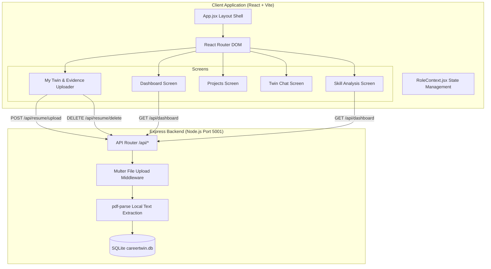

# CareerTwin AI 🚀


A dynamic, AI-powered **digital twin** of a professional identity — replacing the static résumé with an evidenced, evolving, and interactive profile. Built with React, Vite, Express.js, Chart.js, and SQLite.

---

## 👥 Team Details
* **Team Name:** Invictus
* **Track:** AI for Education & Career Development
* **Team Members:**
  * **Gayathri Sathish Kumar**
  * **Rounith Rathesh**
  * **Rithvika B**
  * **Bhavna Sarathy**

---

## 💡 Problem Statement & Solution

### The Problem
* **Static Résumés are Obsolete:** Traditional résumés are static, offline, easily inflated, and fail to capture real-world learning speed or momentum.
* **Recruiter Fatigue:** Recruiters spend hours parsing buzzword-laden résumés and conducting repetitive screening calls just to assess candidate competence.
* **Verification Gap:** It is difficult to verify technical claims without manually checking GitHub repositories, portfolios, or running tedious assessments.

### The Solution
> [!IMPORTANT]
> **The Solution:** CareerTwin AI bridges the trust gap by creating a dynamic, AI-powered professional twin backed by real source code commits and local resume evidence.
> 
> * **Dual-Role Dashboard:** Toggle seamlessly between the **Professional** view (to manage and grow the twin) and the **Recruiter** view (to query and interview twins).
> * **Local PDF Evidence Extraction:** Upload PDF resumes with instant local text parsing (`pdf-parse`) and zero external API dependencies. Includes an **Extracted Resume Text** preview box and quick **Replace / Remove Data** controls.
> * **Zero vs. Sample Visualization State:** Before uploading a resume, all twin readiness metrics, skill bars, and radar points start clean at **0**. Uploading a PDF populates interactive sample visualizations to demonstrate full twin capabilities.

---

## 🎨 Design & Visual Assets

### Dashboard Interface


### Core User Flow Demo


---

## ⚙️ Features & Recent Updates

### 1. Professional Mode
* **Local PDF Evidence Extraction:** Drag & drop PDF uploader with automatic local text extraction (`pdf-parse`), green checkmark status badges, and live character count preview.
* **Replace & Delete Data Workflow:** Click **Replace PDF** or **Remove Data** to delete records from SQLite and instantly reset all application metrics back to the initial 0 state.
* **Twin IQ & Role Readiness Progress Rings:** Live, animated conic progress indicators showing how well-trained the twin is and how ready the user is for their target role.
* **Interactive Skill Constellation & Capability Radar:** A force-directed constellation graph and radar chart comparing individual skills against industry targets.
* **Projects Page UI:** Dedicated Projects screen featuring complexity meters, tech stack badges, and AI twin recommendations.

### 2. Recruiter & Mentor Mode
* **Natural-Language Candidate Search:** Instead of Boolean keywords, recruiters can search in plain English (e.g., *"ML engineers who have shipped to production and know Rust"*).
* **AI Assessment Panel:** A summary showing a verified fit score, strengths, potential watch-outs, and expected ramp time.
* **Interview the Twin:** A live chat panel allowing recruiters to query the candidate's twin, with the twin citing specific repository commits and projects.

---

## 🛠️ Complete Tech Stack

* **Frontend Library:** [React v18.3.1](https://react.dev/)
* **Build System & Dev Server:** [Vite v5.4.0](https://vitejs.dev/)
* **Routing:** [React Router DOM v6.26.0](https://reactrouter.com/)
* **Backend Server:** [Express.js v4.19.2](https://expressjs.com/) (running on Port 5001)
* **File Uploads & Text Extraction:** [Multer v2.2.0](https://github.com/expressjs/multer) & [pdf-parse](https://github.com/mozilla/pdf.js)
* **Database:** SQLite3 (`db/careertwin.db`)
* **Visualizations & Charts:** [Chart.js v4.4.1](https://www.chartjs.org/)
* **Styling:** Vanilla CSS utilizing modular design tokens ([tokens.css](file:///Users/rounithrathesh/CareerTwinAI/src/styles/tokens.css)) and premium global overrides ([global.css](file:///Users/rounithrathesh/CareerTwinAI/src/styles/global.css)).

---

## 🔌 Backend REST API Endpoints

| Method | Endpoint | Description |
| :--- | :--- | :--- |
| `POST` | `/api/resume/upload` | Upload PDF resume, parse text locally, and save record to SQLite. |
| `GET` | `/api/resume/latest` | Retrieve latest uploaded resume and extracted text content. |
| `DELETE` | `/api/resume/delete` | Delete uploaded resume records and reset app state back to 0. |
| `GET` | `/api/dashboard` | Fetch professional living profile and dynamic KPI metrics. |
| `GET` | `/api/twin/profile` | Fetch full Career Twin profile analysis and scores. |

---

## 📐 System Architecture Diagram



---

## 📂 Folder Structure

```
CareerTwinAI/
├── backend/                  # Production Express.js Node backend
│   ├── config/               # Database connection configuration
│   ├── controllers/          # Request handlers (resume, dashboard, twin profile)
│   ├── middleware/           # File upload (Multer) & validation
│   ├── models/               # SQLite models (ResumeModel, DashboardModel)
│   ├── routes/               # Express REST API routes (/api/*)
│   ├── services/             # Local resume text analysis service
│   ├── uploads/              # Local uploaded resume PDFs storage
│   ├── app.js                # Express app middleware & CORS setup
│   └── server.js             # Backend server entrypoint (Port 5001)
├── db/                       # SQLite persistence layer
│   ├── schema.sql            # Relational database schema
│   └── careertwin.db         # SQLite database file
├── src/
│   ├── main.jsx              # Application entrypoint
│   ├── App.jsx               # React Router layout shell
│   ├── components/           # Reusable UI widgets
│   │   ├── CapabilityRadar.jsx  # ChartJS radar chart widget
│   │   ├── SkillBars.jsx        # Horizontal skill bars
│   │   ├── GrowthPath.jsx       # Vertical roadmap timeline widget
│   │   └── Sidebar.jsx          # Navigation sidebar
│   ├── screens/              # Top-level screen components
│   │   ├── Dashboard.jsx        # Main overview dashboard
│   │   ├── Setup.jsx            # My Twin uploader & evidence screen
│   │   ├── SkillAnalysis.jsx    # Skill radar & roadmap screen
│   │   └── Projects.jsx         # Projects portfolio screen
│   └── styles/
│       ├── tokens.css        # Centralized theme tokens
│       └── global.css        # Shared component layouts
├── package.json              # Frontend package manifest
└── README.md                 # Project documentation
```

---

## 🚀 Installation & Running Guide

### Prerequisites
* [Node.js](https://nodejs.org/) v18.0.0 or higher.
* npm (pre-bundled with Node.js).

### Running Locally

1. **Clone the Repository:**
   ```bash
   git clone https://github.com/gayathrisathishkumarr/CareerTwinAI.git
   cd CareerTwinAI
   ```

2. **Start the Express Backend Server:**
   ```bash
   cd backend
   npm install
   npm run dev
   ```
   *The backend will run at [http://localhost:5001](http://localhost:5001).*

3. **Start the Vite Frontend (in a new terminal):**
   ```bash
   # From root folder
   npm install
   npm run dev
   ```
   *The frontend will run locally at [http://localhost:5173/](http://localhost:5173/) or [http://localhost:5174/](http://localhost:5174/).*

---

## 📚 References

* [React Documentation](https://react.dev/reference/react)
* [Vite Configuration Guide](https://vitejs.dev/config/)
* [Express.js Guide](https://expressjs.com/)
* [Chart.js Samples & Setup](https://www.chartjs.org/docs/latest/)
* [Tabler Icons Webfont Reference](https://tabler.io/docs/usage/webfont)
